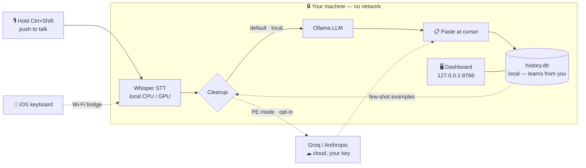

# Echo Flow


**Local-first voice dictation for Windows.** Hold a hotkey, talk, release — the
cleaned-up text lands wherever your cursor is. No subscription, no account, and
your audio never leaves your machine unless you explicitly opt into a cloud
feature.

> Everything the commercial dictation apps charge a monthly fee for, running
> entirely on your hardware, where your voice never touches someone else's server.

```
Hold Ctrl+Shift → talk → release → polished text appears at your cursor.
```

A green microphone in the system tray means it's ready. First launch downloads
the Whisper model once; after that it works fully offline.

---

## Table of contents

- [Features](#features)
- [How it works](#how-it-works)
- [Installation](#installation)
- [Daily workflow](#daily-workflow)
- [Configuration](#configuration)
- [Voice commands (experimental)](#voice-commands-experimental)
- [Teacher-model distillation (optional)](#teacher-model-distillation-optional)
- [Privacy & data flow](#privacy--data-flow)
- [Repository layout](#repository-layout)
- [Troubleshooting](#troubleshooting)
- [iOS](#ios)
- [License & cost](#license--cost)

---

## Features

### Dictation
| Feature | What it gives you |
|---|---|
| **Local transcription** | OpenAI Whisper on-device (`tiny` → `large-v3-turbo`, or `auto` by hardware). Nothing uploaded. |
| **Local cleanup** | A small LLM via Ollama (`qwen2.5:3b-instruct`) polishes raw output — punctuation, capitalization, filler removal. No Ollama → you still get raw Whisper text. |
| **Re-paste** (`Ctrl+Shift+Win`) | Drops your last dictation into a new window — say it once in Slack, paste it again in email. |
| **Snippets** | Short codes expand after cleanup: `btw` → "by the way", `lgtm` → "looks good to me". Case- and word-boundary-aware. |
| **App-aware profiles** | Cleanup style adapts to the focused app — casual punctuation in Slack, symbol-aware in VS Code, full sentences in Gmail. |
| **Casing control** | Learns a word's casing from one edit (`tiktok` → `TikTok` sticks forever, possessives included) and flattens Whisper's accidental "Every Word Capitalized" back to normal sentence case. |
| **Hallucination guard** | Length + RMS gate drops silent/short clips so Whisper can't invent "thank you for watching"; if the model goes off-track, your raw words are pasted (casing-normalized) instead. |

### It learns your voice
Every correction you make through the tray menu feeds back into cleanup. After a
few hundred dictations it knows your jargon, names, and writing style.

| Capability | Detail |
|---|---|
| **Self-grading** | Every dictation gets a 0–100 quality score from four signals (Whisper confidence, hallucination guard, semantic coherence, pattern coverage). |
| **Self-improving loops** | Online weight calibration (SGD against your edits) + exponential pattern decay (14-day half-life) so stale jargon fades. |
| **LLM-free mode** | A `learned` cleanup provider built from your past corrections — runs with no LLM at all once it has enough signal. |
| **Auto-phasing** | Progresses from Whisper + Ollama cleanup → fully self-sufficient LLM-free cleanup as your history grows. |

### Knowledge layer
| Feature | Detail |
|---|---|
| **Notes** | Pin any dictation to promote it to a long-lived knowledge object with title + description. |
| **Tags** | Three-signal auto-suggestion (cluster, similar, concept) with manual confirm. |
| **Action items** | Regex extraction of TODO-style phrases, with a blocklist for daily drivel. |
| **Knowledge graph** | D3.js force-directed view of dictations/notes/concepts, with tag filters, search, and a quality slider. |
| **Semantic search** | Find past dictations by meaning, not just keyword. |
| **Review queue** | Worst-quality-first list of un-edited dictations, one click from the tray. |

### Desktop dashboard
A native local window (Flask + PyWebView, server-rendered, zero CDN/telemetry) at
`http://127.0.0.1:8766` for managing everything: history, insights, custom
vocabulary, snippets, learned casings, style profiles, transforms, scratchpads,
voice-action shortcuts, settings, light/dark theme, and notification sounds.

- **Loopback-only.** Binds to `127.0.0.1` only; the loopback boundary *is* the
  auth model, with a `Host:` header check on every request as DNS-rebinding defense.
- **Never blocks dictation.** Flask runs in a daemon thread; the window runs in a
  separate process. A crash in either can't wedge the hotkey path.
- **Works offline forever.** No SPA framework, no Node toolchain.

Open it from **Tray → Open Dashboard**, `run_dashboard.bat`, or a browser.

---

## How it works

Everything in the dashed box runs **on your machine**. The only paths that leave
it are opt-in and gated behind your own API key.



---

## Installation

### Prerequisites
- **Windows 10/11**
- **Python 3.11+** on your PATH
- *(Recommended)* **[Ollama](https://ollama.com)** for local LLM cleanup
- *(Optional)* an NVIDIA GPU — Whisper uses it automatically if present

### 1. Get the code
```bat
git clone https://github.com/JOhnsonKC201/Echo_FLOW.git
cd Echo_FLOW
```

### 2. Set up the environment
```bat
scripts\setup.bat
```
Creates a Python venv and installs dependencies from `requirements.txt`.

### 3. Launch
```bat
run.bat
```
First launch downloads the Whisper model (a minute or two). When the green
microphone appears in your system tray, you're ready. Transcription runs
**locally** — nothing is uploaded.

### 4. Local LLM cleanup (recommended)
Raw Whisper output gets a light polish from a local LLM via Ollama. Install
Ollama, then pull the default model:
```bat
ollama pull qwen2.5:3b-instruct
```
This is the default (`cleanup.provider: ollama`). If Ollama isn't running, you
simply get Whisper's raw text — no internet required either way.

### 5. Optional: cloud for Prompt-Engineering mode
Regular dictation is 100% local. The one built-in cloud path is
**Prompt-Engineering mode** (`Ctrl+Shift+Alt`), which rewrites a short spoken
idea into a full engineered prompt using Groq, with **your own key**:
```bat
setx GROQ_API_KEY "gsk_..."
```
Close and reopen your terminal so the variable loads (free key from
<https://console.groq.com>, no credit card). Without a key, PE mode falls back to
local Ollama. The same key powers the optional teacher-distillation loop.

### Launchers
| Command | Purpose |
|---|---|
| `run.bat` | Launch the daemon manually |
| `INSTALL.bat` | First-time setup **with Windows autostart** |
| `RESTART.bat` | Kill and relaunch — **run this after editing `config.yaml` or upgrading** |
| `run_dashboard.bat` | Open the dashboard window |
| `UNINSTALL.bat` | Remove the autostart shortcut and optionally wipe data |
| `scripts\run_tests.bat` | Run the pytest suite |

> **After pulling new code, run `RESTART.bat`.** The daemon loads code once at
> startup, so fixes don't take effect until the running tray process is relaunched.

---

## Daily workflow

| Gesture | What happens |
|---|---|
| **Ctrl+Shift** (hold) | Record; release to transcribe + paste at the cursor |
| **Ctrl+Shift+Win** (hold, release) | Re-paste the last dictation into the current window |
| **Ctrl+Shift+Alt** | Prompt-Engineering mode — speak an idea, get a full engineered prompt |
| **Tray icon** | Pause, edit the last dictation, open the review queue, history, knowledge graph, dashboard |

**It learns as you go.** Every correction you make via the tray "edit last
dictation" dialog feeds back into cleanup. Fix `tiktok` → `TikTok` once and it
sticks forever; teach jargon, names, and your writing style over time.

**Casing.** Whisper sometimes hears a sentence as "Every Word Capitalized" —
Echo lowercases mid-sentence words that aren't known proper nouns, so you get
normal sentence case. "Known" = casings you've taught, your Dictionary terms, a
bundled list of common brands/places/names, and `I`. Prefer fewer surprises over
fewer stray capitals? Set `cleanup.casing.flatten_titlecase: false`.

---

## Configuration

Everything lives in `config.yaml`. Most settings are also editable from the
dashboard **Settings** pages. **Run `RESTART.bat` after editing the file directly.**

| Key | Does |
|---|---|
| `hotkey.combo` | Push-to-talk combo (default `ctrl+shift`). |
| `whisper.model` | `tiny` · `base` · `small` · `medium` · `large-v3-turbo` · `auto`. Bigger = more accurate, slower. |
| `cleanup.provider` | `ollama` (local LLM, default) · `learned` (LLM-free, uses your corrections) · `none` (raw Whisper) · `groq` / `anthropic` (cloud, requires `allow_cloud_cleanup`). |
| `cleanup.allow_cloud_cleanup` | Opt in to cloud cleanup (Groq/Anthropic) for **every** dictation — your text leaves the machine. Off by default; falls back to local Ollama if the cloud call fails or the key is missing. Needs `GROQ_API_KEY`. |
| `cleanup.profiles` | App-aware cleanup styles (Slack vs VS Code vs Gmail). |
| `cleanup.casing` | `flatten_titlecase`, `learn_from_edits`, `protect_common_nouns` — all default on. |
| `cleanup.snippets` | Your short-code → phrase expansions. |
| `dashboard.theme` | `dark` or `light` (also togglable in the UI). |

---

## Voice commands (experimental)

Off by default under the `experimental:` block in `config.yaml`. Both layers act
on a spoken **prefix word** (`command_prefix`, default `"computer"`). Command
Mode runs first and falls through to Action Mode on a miss.

### Command Mode — keystrokes
Say `"computer, select all"`, `"computer, save"`, `"computer, scroll down"` and
Echo fires the keystroke from an **allowlist** instead of typing the words.

### Action Mode — semantic actions
| Say… | It does |
|---|---|
| "computer, open spotify" | Launches an app from your `action_apps` allowlist (no shell-from-voice, ever) |
| "computer, open github.com" / "go to docs.python.org" | Opens a site (`http`/`https`/`mailto` only) |
| "computer, search the web for …" | Opens a web search |
| "computer, open email" | Opens your configured mail URL |
| "computer, open downloads folder" | Opens a folder from the `action_folders` allowlist (manage it on the dashboard **Actions** page) |
| "computer, summarize this pdf" | Summarizes the focused document with your **local** model — never a cloud call |
| "computer, create an event lunch with Sam tomorrow" | Writes a local `.ics` **draft** — never touches a calendar API |
| "computer, take a note that the build is green" | Saves a note |
| Media / volume | "play", "pause", "next", "previous", "mute", "volume up/down" via OS media keys |

**Prefix-free** (`action_require_prefix: false`): say the verb with no wake word
("open spotify"). It fires *only* when it resolves to a real shortcut/URL/search
— anything else just types normally, so plain dictation is never swallowed. A
mis-heard wake word (`jarvis` → "Zalvis") is tolerated via fuzzy matching.

**Safety model (non-negotiable):** the allowlist and URL-scheme checks are the
*sole* authority on what executes. Nothing in Action Mode deletes, sends, or
pays. Every attempt is logged to the `voice_actions` table.

---

## Teacher-model distillation (optional)

After each dictation, Echo Flow can re-clean the raw text via a stronger cloud
LLM in the background and store it as a `source='teacher'` row. The pattern miner
learns from both your edits and the teacher's, so the system improves toward a
reference model — not just toward you. Zero added latency on the live path (the
teacher runs in a daemon thread); a quality gate only persists the pair when the
teacher grades at least as well as your version.

```bat
setx GROQ_API_KEY "gsk_..."        :: one-time
```
Then **Dashboard → Settings → Vibe → Teacher model** → enable. Bootstrap from
existing history without waiting for new dictations:
```bat
python scripts\backfill_teacher.py --apply --limit 500
```
Review the pairs at <http://127.0.0.1:8766/teacher> before trusting the loop.

---

## Privacy & data flow

- **Local by default.** No telemetry, no analytics, no auto-update phone-home.
  All audio, transcripts, embeddings, and learning data live in
  `data/history.db` on your machine.
- **Cloud is opt-in and gated.** The only paths that call a cloud API are
  Prompt-Engineering mode (`Ctrl+Shift+Alt`) and the teacher loop — both require
  a key you set yourself and both are off until you flip the toggle.
- **No keys are ever logged.** Startup audits which cloud features are enabled and
  warns on a missing key, without printing the key.
- **Bridge & dashboard stay loopback-only** unless you deliberately change the
  bind address. Read [`docs/MOBILE_BRIDGE.md`](docs/MOBILE_BRIDGE.md) before
  exposing the bridge to your LAN.

### Health check
```bat
curl http://127.0.0.1:8766/api/healthz
```
Returns daemon liveness, current phase, and which optional features are wired —
without exposing keys.

---

## Repository layout

```
app.py            entry point
config.yaml       the only thing you normally edit
src/              the app — daemon, dashboard, voice pipeline
  ├── main.py         daemon: hotkey, recording, transcription, dispatch
  ├── cleanup.py      LLM/learned cleanup + casing/punctuation polish
  ├── transcribe.py   Whisper wrapper
  ├── learn.py        pattern + casing learning from your edits
  ├── hotkey.py       global push-to-talk listener
  ├── inject.py       paste/type at the cursor
  └── dashboard/      Flask app, routes, templates, static assets
tests/            pytest suite (833 tests) — scripts\run_tests.bat
scripts/          setup, backfills, helpers
docs/             architecture, dashboard, mobile, audits, action-layer specs
assets/           app icons
installer/        Windows installer + code-signing
ios/              iOS keyboard-extension port (see ios/README.md)
*.bat / *.vbs     Windows launchers (run / install / restart / uninstall)
*.spec            PyInstaller build specs
```

**Where to read more:** [`PRODUCT_OVERVIEW.md`](PRODUCT_OVERVIEW.md) for the big
picture · [`CHANGELOG.md`](CHANGELOG.md) for feature history · [`docs/`](docs/)
for deeper specs (start at [`docs/README.md`](docs/README.md)).

---

## Troubleshooting

| Symptom | Fix |
|---|---|
| **My fix/setting didn't take effect** | Run `RESTART.bat`. The daemon loads code & config at startup; a running process won't reflect changes until relaunched. |
| **Whisper invents "thank you for watching" on silence** | Already guarded (length + RMS); very short/quiet clips are dropped. |
| **Recording starts when I only wanted to re-paste** | The Ctrl+Shift+Win combo has a veto — add Win within a frame and recording aborts, paste fires instead. |
| **Ollama "connection refused"** | Start the Ollama app or run `ollama serve`. |
| **Hotkey dead after a Windows update** | pynput's global listener sometimes needs a restart — `RESTART.bat`. |
| **Pasting lags in some Electron apps** | Clipboard restore runs in a background thread; usually fine, occasionally a ~100ms hiccup. |
| **Every word comes out Capitalized** | Fixed in current code; if you still see it, `RESTART.bat` so the running daemon picks up the casing pass. |

---

## iOS

A custom keyboard you install via Settings — hold to dictate, release to insert.
It talks to your desktop's local bridge over Wi-Fi, or falls back to on-device
Whisper. Build needs a Mac with Xcode — see [`ios/README.md`](ios/README.md).

---

## License & cost

MIT — see [`LICENSE`](LICENSE).

Nothing if you run fully local. Groq is free at single-human speaking volumes.
Anthropic/OpenAI cost real money per API call, so only use them if you want their
cleanup quality and don't mind the bill.
