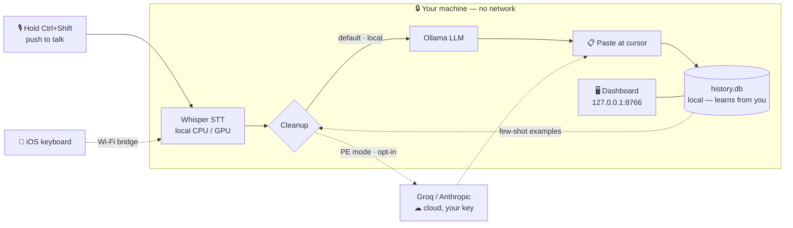

# Echo Flow


A dictation app I built for my own machine because the commercial ones charge monthly fees and send my audio to their servers. This one runs entirely on your computer — your audio never leaves the machine unless you explicitly opt into a cloud feature.

Hold Ctrl+Shift, talk, release. The text shows up wherever your cursor is.

## How it works

Everything in the dashed box runs **on your machine**. The only paths that leave it are opt-in and gated behind your own API key.



## Setup (Windows)

```
scripts\setup.bat
run.bat
```

The setup script creates a Python venv and installs the dependencies. First launch takes a minute or two while Whisper downloads its model. Transcription runs **locally** on your CPU (or GPU if you have one) — nothing is uploaded.

You'll see a green microphone in your system tray when it's ready.

### Local LLM cleanup (recommended)

Raw Whisper output gets a light polish (punctuation, capitalization, removing filler words) from a local LLM via Ollama. Install Ollama from https://ollama.com, then:

```
ollama pull qwen2.5:3b-instruct
```

This is the default (`cleanup.provider: ollama` in `config.yaml`) — transcription and cleanup both run on your machine, no internet needed. If Ollama isn't running, you just get Whisper's raw text.

### Optional: cloud for Prompt-Engineering mode

Regular dictation is 100% local and never calls a cloud API. The one built-in cloud path is **Prompt-Engineering mode** (Ctrl+Shift+Alt), which rewrites a short spoken idea into a full engineered prompt using Groq. It's opt-in and uses your own key:

```
setx GROQ_API_KEY "gsk_..."
```

Close and reopen your terminal so the variable loads (free key from https://console.groq.com, no credit card). Without a key, PE mode falls back to your local Ollama. The same key powers the optional teacher-distillation loop (see below).

## Using it

- **Ctrl+Shift** (hold): record, then release to paste
- **Ctrl+Shift+Win** (hold, release): re-paste the last dictation somewhere else. Useful when you said something in Slack and want the same text in an email.
- **Tray icon**: pause, edit the last dictation, open the review queue, see your history, view a knowledge graph of past dictations
- **Snippets**: say "btw" and it becomes "by the way", "lgtm" becomes "looks good to me". Edit the list in `config.yaml` under `cleanup.snippets`.

It learns as you go. Every time you correct a dictation via the tray menu, that correction feeds back into the cleanup prompt. After a couple hundred dictations it knows your jargon, your names, and the way you tend to write.

**Casing.** Echo keeps capitalization under control two ways:

- **It learns a word's casing from one edit.** Fix `tiktok` → `TikTok` once in the tray "edit last dictation" dialog and every future `tiktok` is capitalized the same way — and protected from being lowercased, including in possessive form (`TikTok's`). See, add, and remove casings on the **Dictionary** page under "Learned casings" — you can teach one directly there (`GitHub`, `iPhone`) without waiting for a dictation, and re-adding a word overrides its casing.
- **It flattens accidental Title-Casing.** Whisper sometimes hears a whole sentence as "Every Word Capitalized". Echo lowercases mid-sentence words that aren't known proper nouns, so you get normal sentence case. "Known" means: casings you've taught, your Dictionary terms, a bundled list of common brands/places/names, and `I`. A proper noun Echo doesn't know yet (a person, a product) may be lowercased the first time — fix it once and it sticks. Prefer fewer surprises over fewer stray capitals? Set `cleanup.casing.flatten_titlecase: false`.

## Configuration

Everything's in `config.yaml`. The interesting knobs:

- `hotkey.combo`: defaults to `ctrl+shift`. Change if it clashes with something.
- `whisper.model`: `tiny`, `base`, `small`, `medium`, `large-v3-turbo`. Bigger = more accurate but slower. `auto` picks one based on whether you have a GPU.
- `cleanup.provider`: `ollama` for the local LLM (default), `learned` for the LLM-free mode that uses your past corrections, `none` to skip cleanup and paste Whisper's raw output. (Regular dictation is local-only; Groq is reserved for Prompt-Engineering mode.)
- `cleanup.profiles`: switches cleanup style based on which app is focused. Slack messages get casual punctuation, VS Code gets symbol-aware cleanup, Gmail gets fuller sentences.
- `cleanup.casing`: `flatten_titlecase` (lowercase stray mid-sentence capitals), `learn_from_edits` (learn a word's casing from a single Fix-dialog edit), `protect_common_nouns` (shield a bundled list of common brands/places/names from flattening). All default on.

## Experimental

Off-by-default features under the `experimental:` block in `config.yaml`. Toggle
them on at your own risk.

- **Command Mode** (`command_mode`): say the prefix word (`command_prefix`,
  default `"computer"`) followed by an allowlisted command — "computer, select
  all", "computer, save", "computer, scroll down" — and Echo fires the keystroke
  instead of typing the words.
- **Action Mode** (`action_mode`): the same prefix, but for semantic actions
  that reach outside the keyboard. Manage your shortcuts right in the dashboard
  **Actions** page — add, edit, and remove apps and folders without touching
  `config.yaml`:
  - "open spotify" — launches an app from your shortcuts (allowlist only;
    spoken text never touches a shell).
  - "open github.com" / "go to docs.python.org" — opens a site (http/https/mailto only).
  - "search the web for &lt;query&gt;" — opens a web search.
  - "open email" — opens your configured mail URL.
  - "open downloads folder" — opens a folder shortcut.
  - "play" / "pause" / "next track" / "previous track" / "mute" / "volume up" — media + volume keys.
  - "open the link in the clipboard" — opens a clipboard URL, only if it's safe.
  - "summarize this pdf" — summarizes the focused document with your **local**
    model (never a cloud call).
  - "create an event lunch with Sam tomorrow" — writes a local `.ics` **draft**.
  - "take a note that the build is green" — saves a note.

  **Prefix-free** (`action_require_prefix: false`): say the verb with no wake
  word at all ("open spotify"). It fires *only* when it resolves to a real
  shortcut/URL/search — anything else just types normally, so plain dictation is
  never swallowed. Media, notes, and events still want the prefix so everyday
  words aren't caught. A mis-heard wake word (Whisper hearing `jarvis` as
  "Zalvis") is tolerated via fuzzy matching.

  Command Mode runs first; an unrecognised command falls through to Action Mode.
  Every action attempt (success or failure) is logged to the `voice_actions`
  table. Nothing in Action Mode deletes, sends, or pays.

## Repository layout

```
src/          the app — daemon, dashboard, voice pipeline
tests/        pytest suite — run with scripts\run_tests.bat
data/         your history.db lives here, and the knowledge-graph HTML
logs/         debug output
scripts/      setup, helpers, utility scripts you'll rarely need
assets/       app icons
installer/    Windows installer + code-signing
ios/          iOS keyboard-extension port — see ios/README.md
docs/         architecture, mobile setup, audits, action-layer specs
config.yaml   the only thing you should normally edit
app.py        entry point
*.bat / *.vbs Windows launchers (run / install / restart / uninstall)
*.spec        PyInstaller build specs
```

Start with [`PRODUCT_OVERVIEW.md`](PRODUCT_OVERVIEW.md) for the big picture, then
[`CHANGELOG.md`](CHANGELOG.md) for the feature history. Deeper docs live in
[`docs/`](docs/) — [`DASHBOARD.md`](docs/DASHBOARD.md),
[`MOBILE_BRIDGE.md`](docs/MOBILE_BRIDGE.md), and the Phase 14 Action Layer specs.

## iOS

There's an iOS version too — a custom keyboard you install via Settings, hold to dictate, release to insert. It talks to your desktop's local bridge over Wi-Fi (or falls back to on-device Whisper). See [`ios/README.md`](ios/README.md) for build steps (needs a Mac with Xcode).

The main entry points: `INSTALL.bat` for first-time setup with autostart, `run.bat` to launch manually, `RESTART.bat` to kill and relaunch (useful after config changes), `UNINSTALL.bat` to remove the autostart shortcut and optionally wipe data.

## Things that broke for me at some point

- **Whisper hallucinating "thank you for watching" on silence**: there's a length+RMS guard now; short or quiet clips get dropped.
- **Recording starts when I just want to re-paste**: the Ctrl+Shift+Win combo has a veto. If you add Win within a frame of pressing Ctrl+Shift, the recording aborts silently and the paste fires instead.
- **Ollama "connection refused"**: start the Ollama desktop app or run `ollama serve` in a terminal.
- **Hotkey doesn't work after Windows update**: sometimes pynput's global listener needs the app restarted. `RESTART.bat`.
- **Pasting in some Electron apps lags**: the clipboard restore happens in a background thread. Usually fine, occasionally a 100ms hiccup.
- **Every word getting comma-separated** (`"Hello, World, Today."`): caused by Whisper's `initial_prompt` style-anchoring on a comma-list of vocabulary terms. Fixed in May 2026 — vocabulary is now wrapped in prose, and `_polish_text` has a comma-storm detector as a safety net. If you upgraded and still see it, `RESTART.bat` the daemon so the new `initial_prompt` builder runs.

## Teacher-model distillation (optional)

After each dictation, Echo Flow can re-clean the raw text via a stronger cloud LLM in the background and store the result as a `source='teacher'` row. The pattern miner learns from both your edits and the teacher's, so the system improves toward a reference model — not just toward you.

```
setx GROQ_API_KEY "gsk_..."        # one-time
```

Then open the dashboard → **Settings → Vibe → Teacher model** and flip "Enable teacher-model distillation". Zero added latency on the live dictation path (the teacher runs in a daemon thread). A quality gate compares the teacher's output to yours and only persists the pair when the teacher grades at least as well.

To bootstrap from your existing history (no waiting for new dictations):

```
python scripts\backfill_teacher.py --apply --limit 500
```

Review the pairs at `http://127.0.0.1:8766/teacher` before you trust the loop wholesale.

## Privacy & data flow

- **Local by default.** No telemetry, no analytics, no auto-update phone-home. All audio, transcripts, embeddings, and learning data live in `data/history.db` on your machine.
- **Cloud features are opt-in and explicitly gated.** Prompt-Engineering mode (Ctrl+Shift+Alt) and the teacher loop are the only paths that call a cloud API. Both require an API key you set yourself and both are off until you flip the toggle.
- **Bridge stays loopback-only** unless you change `mobile.bind_address`. Read [`docs/MOBILE_BRIDGE.md`](docs/MOBILE_BRIDGE.md) before exposing to LAN.
- **Dashboard stays loopback-only** on `127.0.0.1:8766`. Same trust model as local browser tabs.
- **No keys are ever logged.** Startup audits which cloud features are enabled and warns if their key is missing, without printing the key itself.

## Health check

```
curl http://127.0.0.1:8766/api/healthz
```

Returns daemon liveness, current phase, and which optional features are wired (without exposing keys). Useful for tray watchdogs and installers.

## License

MIT — see [`LICENSE`](LICENSE).

## What it costs

Nothing if you run it fully local. Groq is free at the volumes a single human can talk. Anthropic and OpenAI cost real money per API call, so only use them if you want their cleanup quality and don't mind the bill.

